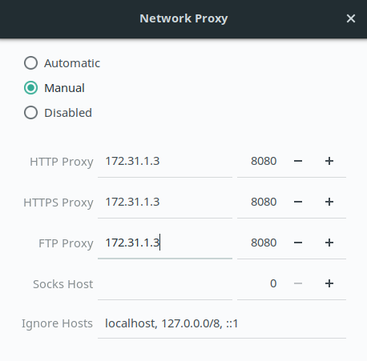

# Proxy

Set proxy in the network settings as shown in the image below .
  
Proxies working: 172.31.1.3 / 6     	
Port: 8080

# Linux

#### Proxy for terminal
	export https_proxy=http://<proxy>:<port>
	export http_proxy=http://<proxy>:<port>
	export ftp_proxy=http://<proxy>:<port>
	
#### Npm
	npm config set proxy http://<proxy>:<port> 
	npm config set https-proxy http://<proxy>:<port>

#### GIT 
	git config --global http.proxy http://<proxy>:<port>

#### BOWER
In your `.bowerrc` file, make the following changes: 

    .bowerrc:
    `{`
      `"directory": "bower_components",` 
      `"proxy": "http://<proxy>:<port>",`
      `"https-proxy":"http://<proxy>:<port>",`
      `"no-proxy":"myserver.mydomain.com"`
    `}`
    
# Mac

To manually change your Proxy settings, follow these steps:
1. Open System Preferences and click the Network panel icon.
2. The network panel opens, showing all the available interfaces. Click the interface you want to configure (usually Ethernet or Wi-Fi).
3. Click the Advanced button to view the full manual interface for network settings.
4. click the Proxies button in the button bar. 
5. Click the checkboxes beside the protocols that you want to configure.
6. Click the protocol names to configure each proxy. Setup fields appear to the right of the protocol list.
7. Enter the proxy information as provided by your network administrator.
8. Click OK to exit advanced setup.
9. Click Apply to activate and begin using your new network settings

# Windows

Setting up proxy in windows:
1. Open Settings.Click Network & Internet.
2. The list of network- and Internet-related settings appears.
3. Click Proxy.The list of available proxy settings appears.
4. In the Manual Proxy Setup section, set the Use a Proxy Server switch to On.
5. In the Address field, type the IP address.In the Port field, type the port.
6. Click Save; then close the Settings window
